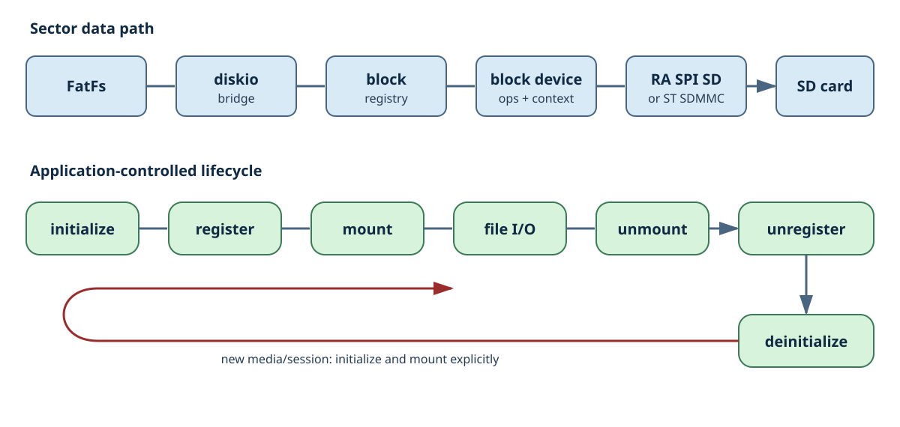
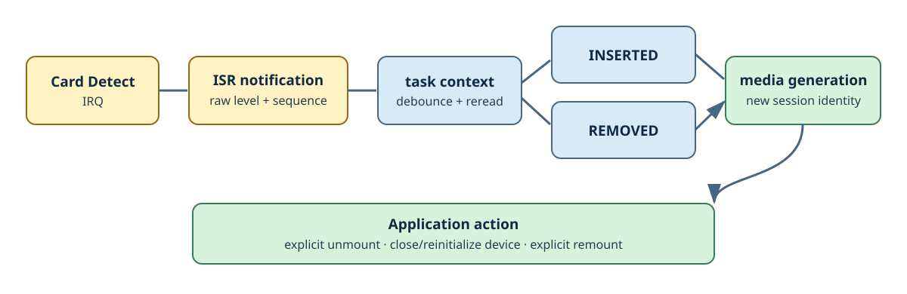

# 通常I/Oとremovable media

## data flowとlifecycle

通常のI/Oは、次の経路で処理されます。

`FatFs` → `diskio bridge` → `block registry` → `mtfs_block_device_t` → `RA SPI SD`または`ST SDMMC` → `SD card`

`diskio bridge`は、FatFsのphysical drive番号を使ってregistryから対応するdeviceを検索し、登録されているblock deviceのoperationを呼び出します。Block Device APIはsector単位で動作し、各portがgeometry、media present、write protection、timeoutなどの共通的な扱いをtarget固有driverへ橋渡しします。

基本的なlifecycleは次のとおりです。

1. target portのcontextを初期化し、`mtfs_block_device_t`を取得します。
2. deviceをphysical drive番号に対応付けてregistryへ登録します。
3. applicationがFatFsをmountします。必要なblock deviceの初期化はdiskio経由で行われます。
4. applicationがfile I/Oを実行します。
5. 終了時やmedia交換時には、applicationが明示的にunmountします。
6. deviceをregistryからunregisterします。
7. target portをdeinitし、IRQ、HAL/FSP channel、kernel objectなどを安全な順序で解放します。

途中で処理に失敗した場合も、applicationはその時点までに取得したresourceだけを逆順に解放します。registryへ登録している間は、deviceのcontextとoperation tableを有効な状態に維持する必要があります。

## Card Detect経路

Card Detect IRQは、挿入または取り外しの可能性を通知するだけです。ISRではraw levelとsequence番号を記録し、必要に応じてworkerを起床します。GPIOの再読み取り、待機、memory allocation、lock、application callback、mount処理はISR内では行いません。

task contextで動作するstate machineが、所定時間のdebounce後に信号を再確認し、`INSERTED`または`REMOVED`を確定します。

確定したeventとdiagnosticsの`media_generation`を使うことで、applicationは以前のcard/sessionと新しいsessionを区別できます。ただし、`media_generation`はmedia交換後の状態を自動的に復旧するための仕組みではありません。

mediaの取り外しが確定した後は、application側で可能な範囲のopen fileをcloseし、明示的にunmountします。その後、deviceを再初期化し、必要に応じて再度mountします。

microT-FSは、次の機能や保証を提供しません。

- open済みfile objectの透過的な復旧
- media挿入時の自動mount
- 取り外されたcardに対する未完了writeの成功保証
- 別のcardへ交換した後も同じsessionを継続できるという保証

IRQ sourceを破棄する場合は、まずmedia serviceとportでnotificationの受付を停止します。その後、IRQをdisable/unregisterしてからcontextをdeinitします。
