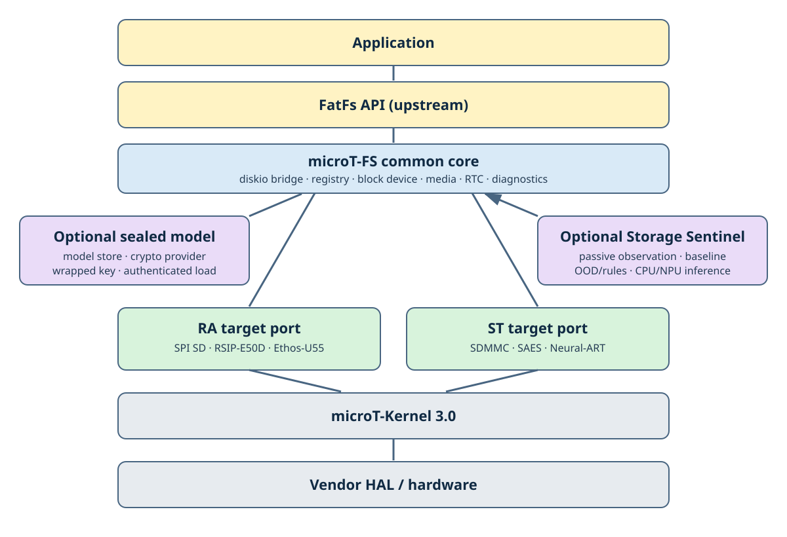

# 全体レイヤー

microT-FSの中心となるのは、FatFsが要求するsector単位のI/Oを、target非依存のBlock Device APIへ接続する層です。通常のfilesystem利用にsealed modelやStorage Sentinelは必要なく、必要に応じてcompile-time feature macroで有効化できます。

## レイヤーと責務

1. **Application**は、mount、file操作、明示的なunmount、およびmedia event発生後の再初期化を制御します。
2. **FatFs API**の`f_mount`、`f_open`、`f_read`、`f_write`などは、FatFs upstreamが提供する公開APIです。microT-FS独自のAPIとして再定義するものではありません。
3. **microT-FS common core**は、共通型、error、time provider、およびremovable-media state machineを提供します。
4. **diskio bridge**の`mtfs_diskio.c`は、FatFsの`disk_*`呼び出しをblock registryへ転送します。この部分はmicroT-FS固有のintegrationです。
5. **block registry/block device**は、physical drive番号と`mtfs_block_device_t`を対応付け、initialize、status、read、write、sync、geometry、trimの共通contractを提供します。
6. **removable media/RTC/diagnostics**は、それぞれCard Detectのdebounce、FatFs timestamp、versioned snapshotを提供します。いずれもapplication側で明示的に組み合わせて使用します。
7. **sealed model/model store**はoptional featureです。認証付き暗号packageをhardware-backed crypto providerで開き、認証済みplaintextを呼び出し側所有のRAMへloadします。
8. **Storage Sentinel**もoptional featureです。通常I/Oですでに取得しているdiagnosticsやtimingを受動的に観測し、baseline-relative featureと判定結果を生成します。
9. **RA/ST target port**は、SPI SD、SDMMC、RTC、crypto、NPUをcommon boundaryへ接続します。
10. **microT-Kernel 3.0**は、task、event flag、mutex、device管理などのOS機能を提供します。
11. **vendor HAL/hardware**には、FSPまたはSTM32 HAL、crypto engine、NPU、SD interface、GPIO/IRQが含まれます。

## upstreamとの境界

`src/fatfs/ff.c`、`ff.h`、`ffunicode.c`、`ffsystem.c`などのFatFs本体はupstream由来です。由来は`src/fatfs/UPSTREAM.md`、microT-FSへ統合する際の変更点は`CHANGES.mtfs.md`に記録しています。

microT-FSが所有するのは、主に`mtfs_diskio.c`、`mtfs_fattime.c`、sealed reader adapter、および`src/`以下の`mtfs_*` APIです。

FatFsのfile objectやmount semanticsはFatFsのcontractに従います。microT-FSのBlock Device APIは、その下にあるmedia accessを置き換え可能にするためのinterfaceであり、FatFs APIの互換実装ではありません。
