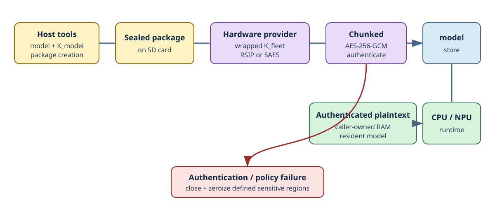

# sealed model

sealed modelは、host上で作成した認証付き暗号packageをSD cardへ保存し、target上で認証・検証しながら呼び出し側所有のRAMへloadするoptional featureです。`MTFS_ENABLE_SEALED_MODEL=1`で有効にします。

## packageと鍵

host toolは、model payload、manifest、およびpackageごとの`K_model`を含むsealed packageを作成します。

device側ではfleet共通鍵`K_fleet`をplaintextのまま保存せず、hardwareでwrapされたfleet key recordをtargetのkey storeから取得します。

- EK-RA8P1では、RSIP-E50D providerがwrapped fleet keyをhardware operationへ渡します。
- STM32N6570-DKでは、SAES providerがdevice hardwareに紐付いたkey operationを使用します。

providerはpackage内の`K_model`をunwrapし、chunked AES-256-GCMを使って各chunkの機密性と完全性を検証します。

`model_store`は、認証済みmanifestに対してtarget/accelerator/format/sizeのpolicyを検証し、plaintextをdestination RAMへ順次loadします。loadされたmodelやSentinel bundleはresident modelとして保持され、NPUまたはCPU runtimeから参照できます。

reader、crypto provider、work buffer、destinationの所有権は呼び出し側にあります。

- open中はreaderとcrypto providerを有効な状態に維持します。
- load処理中はwork bufferを有効な状態に維持します。
- modelを使用している間はdestination RAMを有効な状態に維持します。

work bufferには一時的にplaintextが格納される可能性があるため、秘密情報として扱う必要があります。

authentication、format、policy、I/O、runtime初期化のいずれかに失敗した場合、APIは契約で定められた範囲の一時buffer、key handle、destinationをzeroizeします。呼び出し側も、自身が所有する残りのbufferをlifecycleに従って適切に消去する必要があります。

## security boundary

初版では、TrustZoneを使ったcomponent間の分離は行いません。

- EK-RA8P1はflat buildです。
- STM32N6570-DKはFullSecure single imageです。
- wrapped keyとAES-GCMにはhardware-backed key operationを使用します。
- 同一firmware内のcomponent間を隔離することは保証しません。
- 実行中RAMを解析できる攻撃、完全に侵害されたfirmware、anti-rollback、OTA更新は保証範囲外です。

そのため、storage上のpackageを保護し、hardware-backed keyを利用していても、実行中のplaintextがあらゆる攻撃から保護されるわけではありません。

application側では、model RAMの配置、lifetime、debug access、cleanupを含め、system全体として必要なsecurity policyを設計する必要があります。
