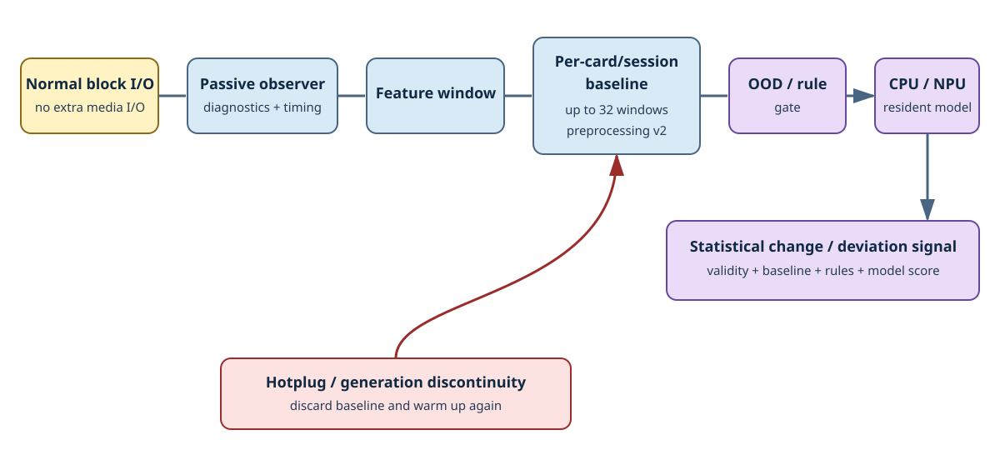

# Storage Sentinel

Storage Sentinelは、baseline確立後の統計的な変化や逸脱を検出するoptional機能です。SD cardの寿命や故障時期を予測するものではありません。

## passive observation

observerは通常のBlock Device API呼び出しをwrapし、read/write/syncに関するdiagnosticsとlatency histogramを収集します。Storage Sentinelのために追加のmedia I/Oを発行することはありません。

samplingは呼び出し側が必要なタイミングで実行します。versioned diagnostics/timing snapshotと、applicationが保持するmedia metadataをもとにfeature windowを生成します。

## baseline-relative preprocessing v2

card/sessionごとに最大32 windowのwarmupを行い、baselineを確立します。preprocessing v2では、現在のwindowをbaselineとの差分に基づくrelative featureへ変換します。

featureのsaturation、data不足、counterの不連続、media generationの不一致などは、OOD（out-of-distribution：学習時に想定した分布から外れた状態）またはruleによる判定に反映されます。

baselineはcardごと、かつsessionごとに管理されます。hotplug、media generationの変更、diagnosticsのresetなどによって前後のdataを連続したものとして扱えなくなった場合は、既存のbaselineを破棄し、新しいcard/sessionとしてwarmupからやり直します。

## 判定経路

まずpolicy/ruleとOODによる判定を行い、その条件を満たしたwindowだけをresident modelへ入力します。

inferenceには、portableなCPU実装、またはtarget providerを介したEthos-U55/Neural-ART NPUを利用できます。判定をAI modelの出力だけに依存させるのではなく、入力のvalidity、baseline state、OOD、rule、model scoreを組み合わせて最終的な結果を決定します。

Storage Sentinelは、次のことを保証するものではありません。

- SD cardの寿命や故障時期の予測
- あらゆるSD cardに共通する絶対的な健康状態の判定
- 未観測の故障modeを含む、あらゆる異常の完全な検出
- AI model単独による安全性の判断

実運用では、Storage Sentinelの判定結果をdiagnostic signalの1つとして扱い、application固有のlogging、再試行、safe stateへの移行、maintenance判断などへつなげてください。
