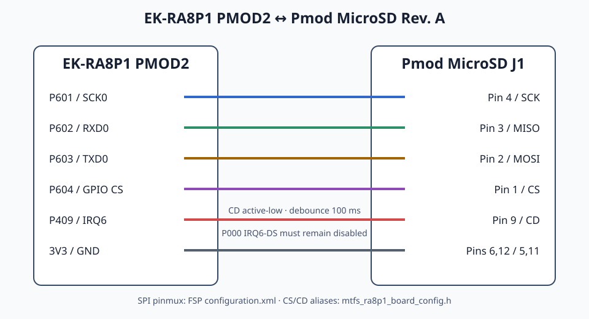

# Board configuration

## EK-RA8P1

Digilent Pmod MicroSD Revision AをEK-RA8P1のPMOD2へ接続します。電源には必ず3.3 Vを使用し、それ以外の電圧を供給しないでください。

| Pmod MicroSD J1 | Signal | EK-RA8P1 PMOD2 / MCU | 設定元                                   |
| --------------- | ------ | -------------------- | ------------------------------------- |
| Pin 4           | SCK    | PMOD2_RTS_SSL / P601 | FSP `configuration.xml`、SCI0 SCK0     |
| Pin 3           | MISO   | PMOD2_RX / P602      | FSP `configuration.xml`、SCI0 RXD0     |
| Pin 2           | MOSI   | PMOD2_TX / P603      | FSP `configuration.xml`、SCI0 TXD0     |
| Pin 1           | CS     | PMOD2_CTS / P604     | board config header、GPIO output       |
| Pin 9           | CD     | PMOD2_GPIO1 / P409   | board config headerとFSP external IRQ6 |
| Pin 6 / 12      | VCC    | PMOD2 3V3            | board配線                               |
| Pin 5 / 11      | GND    | PMOD2 GND            | board配線                               |

Card Detectはactive-lowで、IRQ channel 6、debounce 100 msに設定します。

P409をIRQ6へ割り当てる一方で、P000の`IRQ6-DS`は無効にし、通常のGPIO inputとして使用します。P000とP409の両方を同時にIRQ6 sourceへ割り当てると競合するため、避けてください。

SPIのalternate-function pinmux、P409のpinmux、IRQ callbackは、各RA projectの`configuration.xml`で設定します。変更する場合はFSP Pins/Stacksから設定し、code generationを実行してください。生成された`bsp_pin_cfg.h`は直接編集しません。

C側から変更できるCS/CD alias、active level、debounce、IRQ channelは、[`mtfs_ra8p1_board_config.h`](../src/ports/ra_fsp/boards/ek_ra8p1/mtfs_ra8p1_board_config.h)で定義しています。

別のpinへ変更する場合は、物理配線、`configuration.xml`、board config headerの3つを対応させて更新してください。

## STM32N6570-DK

on-board microSD socketはboard上でSDMMC2へ固定接続されており、4-bit busを使用します。

| Signal            | MCU pin               | 設定箇所                      |
| ----------------- | --------------------- | ------------------------- |
| D0 / D1 / D2 / D3 | PC4 / PC5 / PC0 / PE4 | Cube `.ioc`とgenerated MSP |
| CK / CMD          | PC2 / PC3             | Cube `.ioc`とgenerated MSP |
| Card Detect       | PN12 / EXTI12         | Cube `.ioc`とboard port    |
| Write Protect     | 接続なし                  | softwareからの取得なし           |

Card Detectはactive-lowで、debounce 500 ms、EXTI12 priority 6に設定します。SDMMC2 IRQ priorityは5です。

pinmux、GPIO pull/edge、SDMMC2 bus width、IRQ priorityは、各targetの`.ioc`およびCube生成設定で管理します。変更する場合はCubeMX/CubeIDEから設定してcode generationを実行し、生成された`main.h`、`main.c`、`stm32n6xx_hal_msp.c`は直接編集しません。

software側から変更できるCD alias、active level、debounce、IRQ設定は、[`mtfs_stm32n6570_dk_board_config.h`](../src/ports/stm32_cube/boards/stm32n6570_dk/mtfs_stm32n6570_dk_board_config.h)で定義しています。IDMA/pollingは`MTFS_STM32_SD_USE_IDMA`で選択します。

これらのsoftware設定を変更しても、board上で固定されている配線やSDMMC2のalternate-function pinは変更されません。

別のboardへ移植する場合は、[Porting checklist](porting.md)に従って、新しいboard bindingを作成してください。
